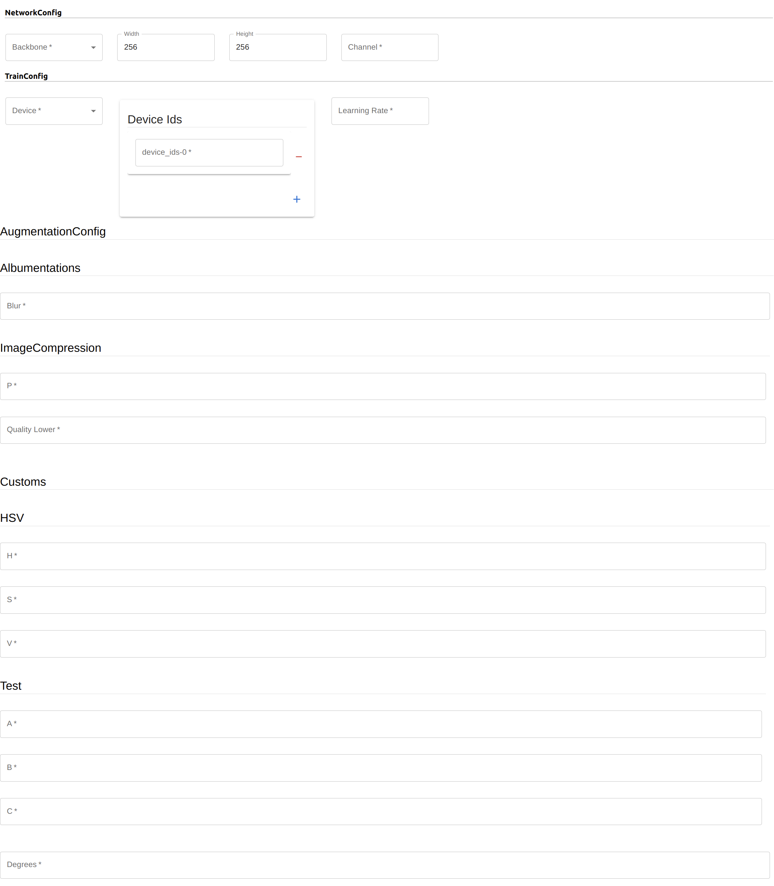

# How to generate forms/templates automatically

- Frontend: `Javascript` with `React`
- Backend: `Python` with `FastAPI`

## Backend 

```cmd
python -m uvicorn main:app --reload
```

#### json-schema

There are several `json-schema` such as 

- `TrainConfig`
- `ValConfig`
- `ModelConfig`
- `AugmentationsConfig`
- ...

These are the keys and the values are `json-schema`.

For example, 
```json
{'TrainConfig': {'properties': {'device': {'enum': ['gpu', 'cpu'
                ], 'title': 'Device', 'type': 'string'
            }, 'device_ids': {'items': {'type': 'integer'
                }, 'title': 'Device Ids', 'type': 'array'
            }, 'learning_rate': {'title': 'Learning Rate', 'type': 'number'
            }
        }, 'required': ['device', 'device_ids', 'learning_rate'
        ], 'title': 'TrainConfig', 'type': 'object'
    }, 'AugmentationConfig': {'$defs': {'Albumentations': {'properties': {'Blur': {'maximum': 1.0, 'minimum': 0.0, 'title': 'Blur', 'type': 'number'
                    }, 'ImageCompression': {'$ref': '#/$defs/ImageCompression'
                    }
                }, 'required': ['Blur', 'ImageCompression'
                ], 'title': 'Albumentations', 'type': 'object'
            }, 'Customs': {'properties': {'hsv': {'$ref': '#/$defs/HSV'
                    }, 'degrees': {'maximum': 1.0, 'minimum': 0.0, 'title': 'Degrees', 'type': 'number'
                    }
                }, 'required': ['hsv', 'degrees'
                ], 'title': 'Customs', 'type': 'object'
            }, 'HSV': {'properties': {'h': {'maximum': 1.0, 'minimum': 0.0, 'title': 'H', 'type': 'number'
                    }, 's': {'maximum': 1.0, 'minimum': 0.0, 'title': 'S', 'type': 'number'
                    }, 'v': {'maximum': 1.0, 'minimum': 0.0, 'title': 'V', 'type': 'number'
                    }, 'test': {'$ref': '#/$defs/Test'
                    }
                }, 'required': ['h', 's', 'v', 'test'
                ], 'title': 'HSV', 'type': 'object'
            }, 'ImageCompression': {'properties': {'p': {'maximum': 1.0, 'minimum': 0.0, 'title': 'P', 'type': 'number'
                    }, 'quality_lower': {'maximum': 100.0, 'minimum': 0.0, 'title': 'Quality Lower', 'type': 'number'
                    }
                }, 'required': ['p', 'quality_lower'
                ], 'title': 'ImageCompression', 'type': 'object'
            }, 'Test': {'properties': {'a': {'maximum': 1.0, 'minimum': 0.0, 'title': 'A', 'type': 'number'
                    }, 'b': {'maximum': 1.0, 'minimum': 0.0, 'title': 'B', 'type': 'number'
                    }, 'c': {'maximum': 1.0, 'minimum': 0.0, 'title': 'C', 'type': 'number'
                    }
                }, 'required': ['a', 'b', 'c'
                ], 'title': 'Test', 'type': 'object'
            }
        }, 'properties': {'Albumentations': {'$ref': '#/$defs/Albumentations'
            }, 'Customs': {'$ref': '#/$defs/Customs'
            }
        }, 'required': ['Albumentations', 'Customs'
        ], 'title': 'AugmentationConfig', 'type': 'object'
    }, 'NetworkConfig': {'properties': {'backbone': {'enum': ['efficientnetb0', 'efficientnetb1', 'efficientnetb2'
                ], 'title': 'Backbone', 'type': 'string'
            }, 'width': {'default': 256, 'minimum': 32, 'title': 'Width', 'type': 'integer'
            }, 'height': {'default': 256, 'minimum': 32, 'title': 'Height', 'type': 'integer'
            }, 'channel': {'minimum': 1, 'title': 'Channel', 'type': 'integer'
            }
        }, 'required': ['backbone', 'channel'
        ], 'title': 'NetworkConfig', 'type': 'object'
    }
}
```

## FrontEnd

```
npm run start
```

#### By `react-json-schema-form`
```javascript
<Form
    schema={augmentationsSchema}
    validator={validator}
    onChange={handleConfigChanges}
    onError={log('errors')}
    children={true} // hide the submit button
    uiSchema={{"ui:ObjectFieldTemplate": AugmentationsFieldTemplate}}
/>
```

Each of `Form`'s ui is designed manually by `ui:ObjectFieldTemplate`.

For example, the above `json-schema` example generate the below forms/templates:


